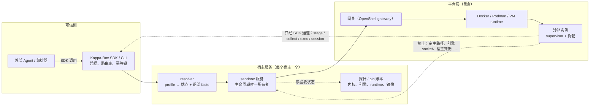
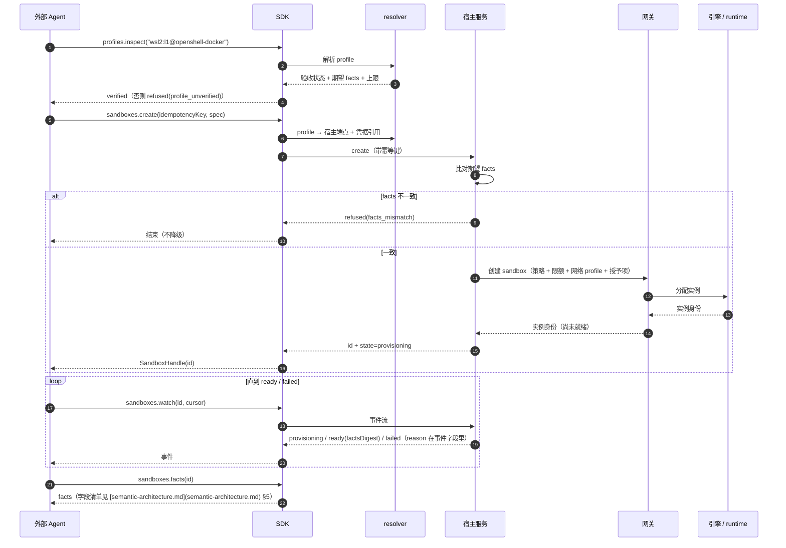
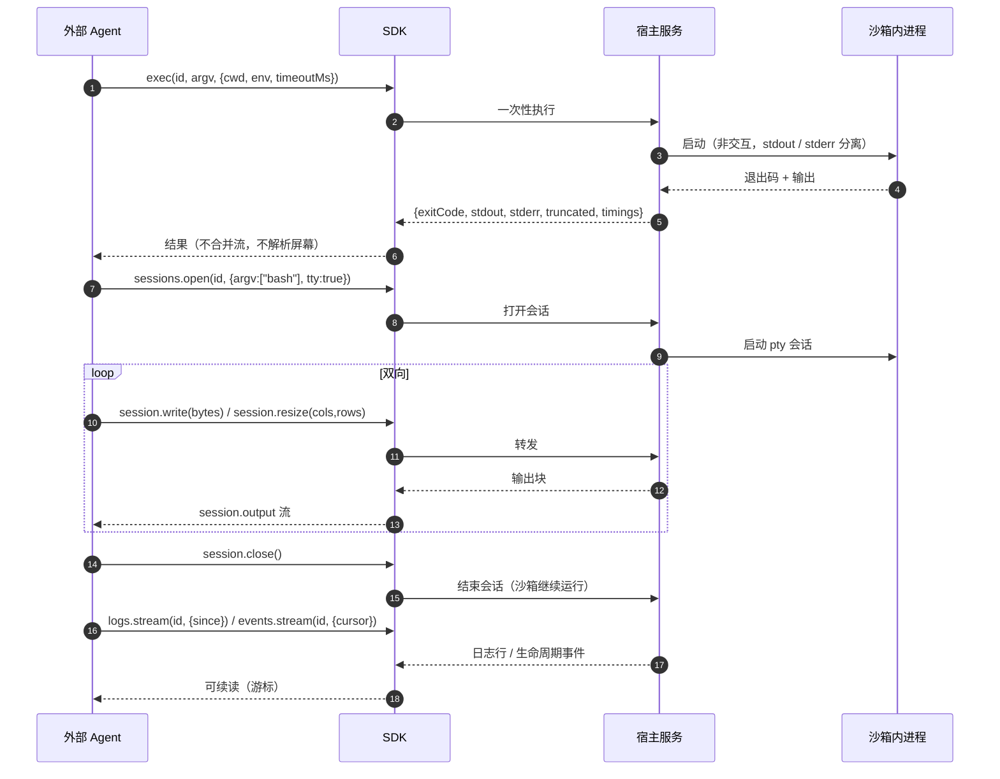
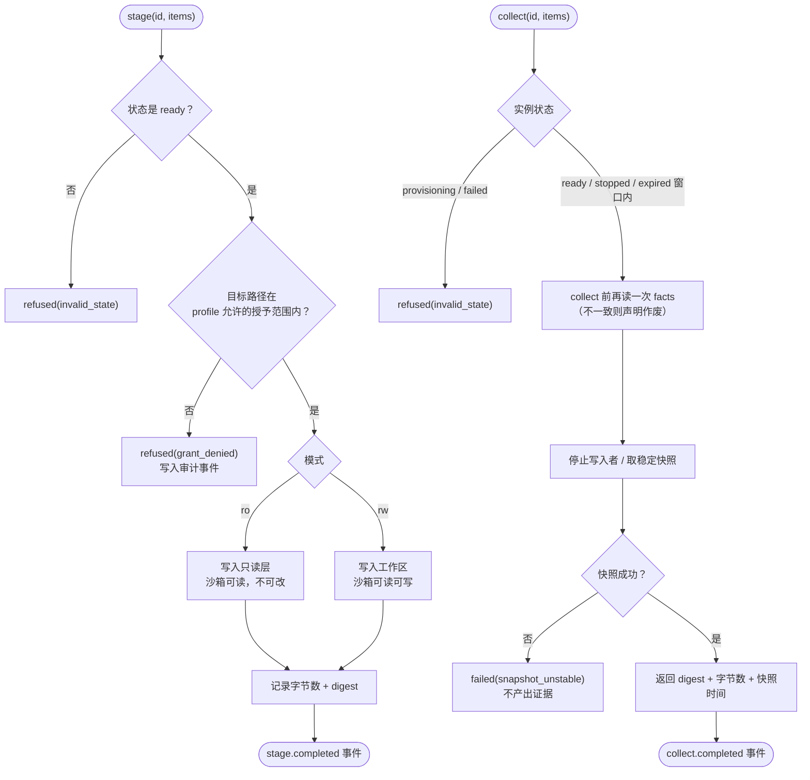
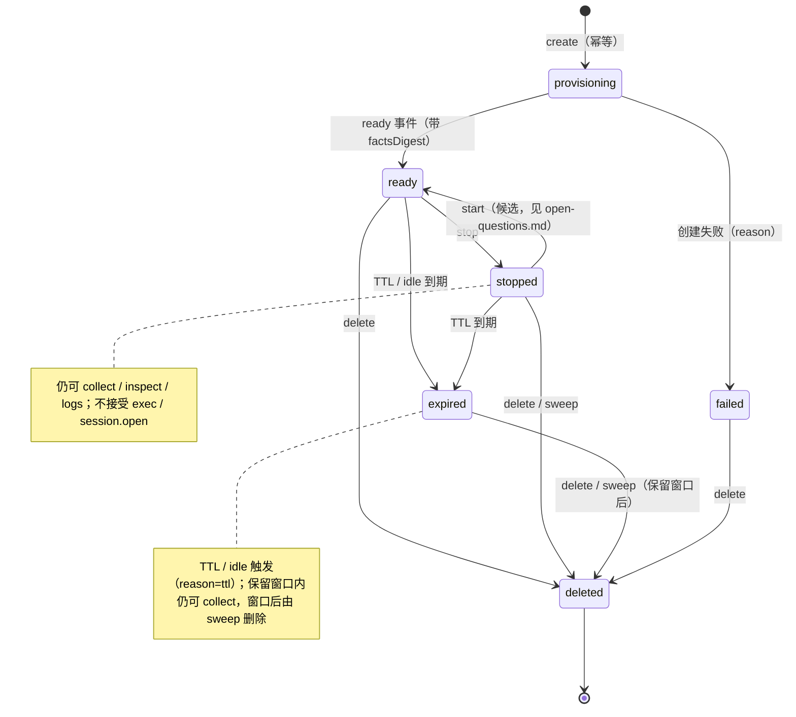
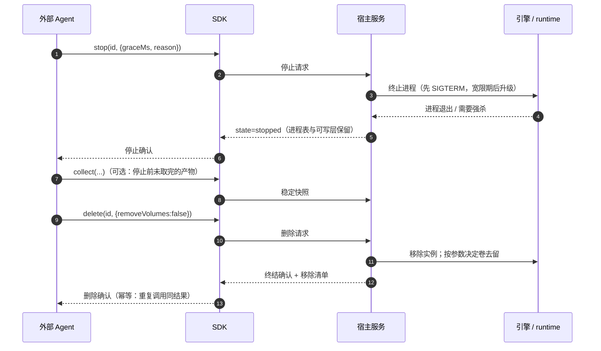
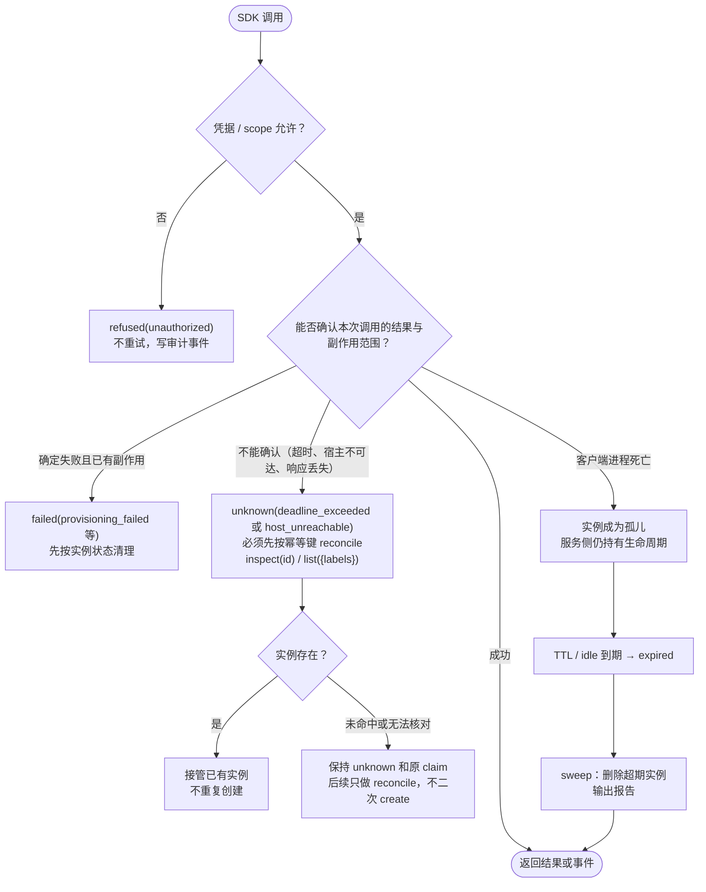

# 流程与状态

> 状态：接口草案、首个 runtime vertical slice，以及进程内 S1 operation/event facade（2026-09-15）。本文描述外部 Agent 的调用、事件与状态；当前 `runtime-vertical-slice` 已真实执行 Windows/WSL2 OpenShell + Docker 的最小 create → ready → exec → stop → delete 链路。S1 facade 把 inspect / create / wait-ready / exec / collect / delete 收成带 `operationId` 的 outcome，并用进程内游标暴露事件；当前宿主在 `profile_unverified` 处拒绝 create，不进入 ready。宿主服务、完整 SDK、facts、session、稳定快照和攻击探针仍在实现中。
> 宿主内部实现（引擎、网关、探针）按黑盒处理。规则的单一定义在 [interface.md](interface.md) §5，
> 本文只把规则画出来并标注对应关系；未决项汇总在 [open-questions.md](open-questions.md)。

## 1. 对象

| 对象 | 由谁持有 | 关键字段 |
| --- | --- | --- |
| Host | 运维注册 | host-class、端点、凭据引用、可达性状态 |
| Profile | 宿主服务登记，SDK 只读 | `<host-class>:<tier>[@variant]`、`acceptance`、期望 facts、上限 |
| Sandbox | 宿主服务（生命周期唯一所有者） | id、profile、state、labels、镜像 digest、限额、网络 profile、TTL |
| Session | 宿主服务，随沙箱存在 | sessionId、argv、tty、输出流、cwd |
| Artifact | 宿主服务 | 来源/目标路径、字节数、digest、快照时间 |
| Event | 宿主服务 | 游标、类型、时间、facts digest（就绪时） |

## 2. 最小调用序列

```ts
const kbox = new KappaBox({ credentialRef: "env:KAPPA_BOX_TOKEN" });   // 宿主由 profile 决定，不另给 route

const profile = await kbox.profiles.inspect("wsl2:l1@openshell-docker");
if (profile.acceptance !== "verified") throw new Error("refused(profile_unverified)");

const sb = await kbox.sandboxes.create({
  idempotencyKey: "run-42/task-7/attempt-1",
  profile: "wsl2:l1@openshell-docker",
  image: "ghcr.io/example/base@sha256:…",
  resources: { cpu: 2, memoryBytes: 2 ** 31, pids: 256 },
  network: "restricted",                       // 命名 profile，不是任意主机名列表
  grants: [{ path: "/work", mode: "rw" }],     // 可授予范围由 profile 决定
  env: { MODE: "task" },
  ttlSeconds: 1800,
  labels: { runId: "run-42", taskId: "task-7" },
});

await kbox.sandboxes.waitReady(sb.id, { timeoutMs: 120_000 });   // 就绪是事件
const facts = await kbox.sandboxes.facts(sb.id);                 // 事实先于使用

await kbox.stage(sb.id, [{ source: "artifact://candidate.tgz", targetPath: "/work/candidate.tgz" }]);
const run = await kbox.exec(sb.id, ["pytest", "-q"], { cwd: "/work", timeoutMs: 300_000 });

const session = await kbox.sessions.open(sb.id, { argv: ["bash"], tty: true });
session.write("ls -la\n");
for await (const chunk of session.output) process.stdout.write(chunk);
await session.close();                          // 只结束这个会话，不结束沙箱

const report = await kbox.collect(sb.id, [{ path: "/work/report.json" }]);
await kbox.sandboxes.stop(sb.id, { graceMs: 10_000, reason: "task-complete" });
const late = await kbox.collect(sb.id, [{ path: "/work/trace.log" }]);   // stopped 仍可取证
await kbox.sandboxes.delete(sb.id, { removeVolumes: false });           // 终结；命名卷保留（delete 后不再能通过操作面读取实例内容）
```

当前宿主走拒绝链，不走上面的 ready 序列。`profiles.inspect` 返回登记表上的 `unverified`；随后已登记 profile 的 `sandboxes.create` 在 claim / backend 前给出 `refused(profile_unverified)`，未登记 profile 给出 `refused(profile_unknown)`，都不分配 `sandboxId`。`observe(cursor)` 仍能读到这次操作事件，并把 `runId` / `requestId` / `operationId` / `profileId` 关联在一起。已知实例的 `waitReady` / `exec` / `delete` 错误事件另带 `sandboxId`；S1 outcome identity 不含该字段。`waitReady` 只有状态为 `ready` 时成功，且不提供已验证 facts；对新进程里已有的 sqlite claim，inspect 超时保持原 claim，不先 adopt 改写，也不二次 create。`collect` 在稳定快照未实现前不返回 `artifactRef`；sqlite / `OSError` 查找失败是 `unknown(host_unreachable)`。

## 3. 调用面与信任边界



对应规则：[interface.md §1](interface.md) 的三条硬约束，以及 §5 第 7 条（文件通道）。

## 4. 创建（create → ready）



对应规则：§5 第 1、2、3、4 条（第 3 条的「collect 前再读一次」落在 §6 图）。

## 5. 交互（exec / session / logs）



对应规则：§5 第 6 条。

## 6. 文件：stage 与 collect



对应规则：§5 第 7、8 条。

## 7. 生命周期状态机



对应规则：§5 第 5、9 条。

## 8. 管理动作语义

| 动作 | 谁可以调用 | 效果 | 幂等 | 留下的证据 |
| --- | --- | --- | --- | --- |
| `stop` | 外部 Agent（受 scope 限制） | 优雅终止进程、冻结实例 | 是（已停止则无副作用） | stop 事件 + reason + 状态前后 |
| `start` | 外部 Agent | 从 `stopped` 恢复（**候选动作**，是否进首版见 [open-questions.md](open-questions.md)） | 是 | start 事件；后端不支持恢复时 `refused(unsupported)` |
| `delete` | 外部 Agent | 移除实例与可写层 | 是 | delete 事件 + 是否删卷 + 最终状态 |
| `sweep` | 运维 / 宿主服务自身 | 删除超期孤儿与过期实例 | 是 | sweep 报告（逐个实例的原因与时间） |
| TTL 到期 | 宿主服务 | `ready` / `stopped` → `expired` | 是 | expired 事件（reason=ttl） |
| `session.close` | 外部 Agent | 只结束会话 | 是 | session 关闭事件 |

停止与删除的时序：



对应规则：§5 第 5 条。`provisioning` 期间不接受 `delete`（先 `watch` 到 `ready` 或 `failed`）；
`expired` 与 `stopped` 一样可以被 `delete` 直接终结。

## 9. 失败、重试与孤儿



对应规则：§5 第 10、11 条。错误码与可重试性见 [interface.md](interface.md) §6。

注：状态名 `failed` 与结果包装 `failed(码)` 是两回事——前者指实例状态，后者指本次调用已产生副作用后失败。`unknown(码)` 表示不能确认本次调用的副作用范围，必须先 reconcile，不得当作 `refused` 重试出第二个实例；调用前即可确定未发出请求的拒绝仍是 `refused`，不是 `unknown(host_unreachable)`。同键若仍无 sandbox 身份（`sandbox_name=NULL` 的未完成 claim）：先按幂等键 reconcile；命中则接管。未命中时，仅 selector 返回 `[]` 或明确的空 `sandboxes`/`items`/`data` 数组可记为「明确无匹配」。只有已记录 `failed(provisioning_failed)` 且明确无匹配时允许同键重发。`unknown` 或没有已存 outcome 的未完成 claim 即使遇到空集合也保持待核对，不再 create：首次 `--detach` 请求可能仍在受理中，空列表不能证明它不会稍后出现；后续 reconcile 命中则接管。非空 list/envelope 零匹配、字段缺失、image/profile 不一致或 reconcile 失败均保持原结果，也不得把 `failed` 改写为 `host_unreachable`。后端调用前的 request / profile / image / env 校验失败不得改写成 `unknown`，也不得留下挡死同键重试的空 claim。

## 10. 六件事的落地映射

| 内部六件事 | 对外操作 |
| --- | --- |
| `prepare`（选定 profile、启动 runtime、记录事实） | `profiles.inspect` → `sandboxes.create` → `waitReady` → `facts` |
| `facts`（提交生效值） | `sandboxes.facts` |
| `stage`（放入候选、任务材料、非秘密配置） | `sandboxes.stage` |
| `launchSubject`（以正式接口启动被测 Agent） | `sessions.open`（需要交互或长驻会话时）或 `exec`（一次性命令） |
| `collect`（按允许范围取出产物） | `sandboxes.collect` |
| `teardown`（清理，按保留策略留产物） | `stop` + `delete`（分开，因为 stop 保留可写层用于取证） |
