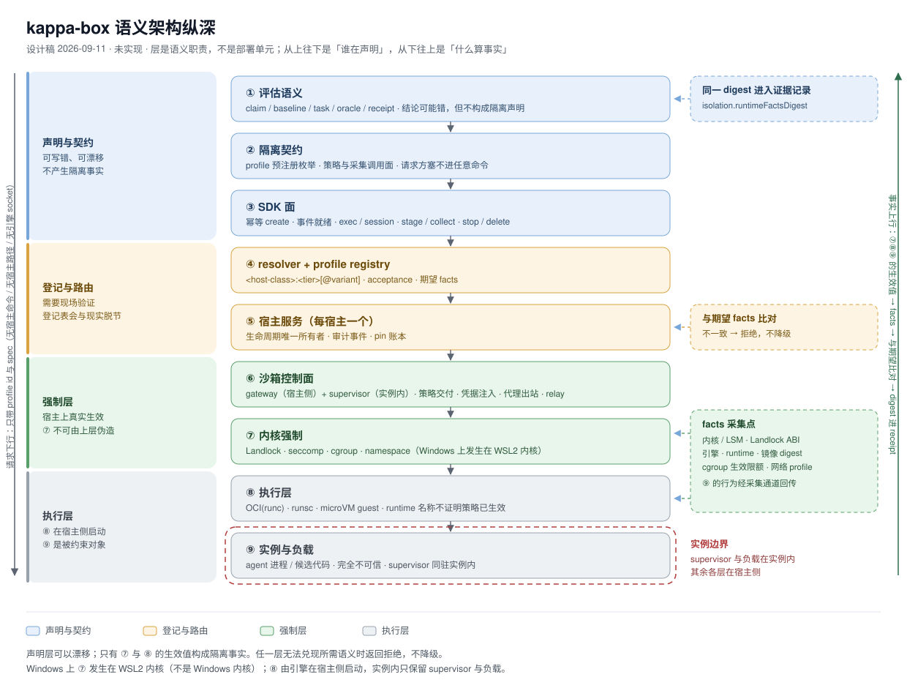

# 语义架构纵深

> 状态：说明文档（2026-09-11），对应已完成初始 facts/profile 合同和只读盘点、但尚未完成完整 runtime 的 [kappa-box](../README.md)。本文解释
> [纵深图](../diagrams/kappa-box-semantic-depth.svg) 的分层与不变量，不新增接口、不改变
> [design.md](design.md) 的形态决定与 [interface.md](interface.md) 的边界。
> 事实字段的定义见本文 §5，探针套件见 [profiles.md](profiles.md) §4，依据与证据边界见 [evidence.md](evidence.md)。

## 1. 为什么要画纵深

「隔离」这个词在不同层里含义不同：评估语义层说的是一次运行的隔离**声称**；契约层说的是
profile 的**预注册枚举**；登记层说的是**期望 facts**；控制面说的是**策略交付**；内核层才是
**实际生效的限制**。把这几层画成一张纵深图的目的，是让下面这件事一眼可见：

> 上面几层可以被写错、被漂移、被伪造；只有下面的强制层与执行层决定实际发生了什么。

所以纵深图的读法是「从上往下：谁在声明」，以及「从下往上：什么算事实」。

## 2. 九层

| # | 层 | 谁拥有 | 这一层的语义 | 可否漂移 / 伪造 | 向上提供 |
| --- | --- | --- | --- | --- | --- |
| ① | 评估语义 | 评估与采用侧（kappa-box 之外） | claim、baseline、task、oracle、证据记录 | 结论可能错，但不构成隔离声明 | 运行身份与证据骨架 |
| ② | 隔离契约 | 调用方与 kappa-box 的约定 | profile 预注册枚举、策略与采集调用面 | 请求方塞不进任意命令 | 实例化与采集的调用面 |
| ③ | SDK 面 | 外部 Agent / 编排器 | 幂等 create、事件就绪、exec / session、stage / collect、stop / delete | 客户端可崩、可超时、可重放 | 调用与事件流 |
| ④ | resolver + profile registry | kappa-box | `<host-class>:<tier>[@variant]`、验收状态（`acceptance`）、期望 facts | **可以漂移**：登记表会与宿主现实脱节 | 路由与可用性判定 |
| ⑤ | 宿主服务 | kappa-box（每宿主一个） | 生命周期唯一所有者、审计事件、pin 账本 | 实现未验证前只是声明 | 实例身份、事实、审计 |
| ⑥ | 沙箱控制面 | OpenShell（gateway 宿主侧 / supervisor 实例内） | 策略交付、凭据注入、代理出站、relay、日志 | 控制面版本与策略可被写错 | 实例内强制与数据通道 |
| ⑦ | 内核强制 | 宿主内核（Windows 上为 WSL2 内核） | Landlock、seccomp、cgroup、namespace | **不可由上层伪造**；只能被错误配置或未启用 | 生效值（LSM、ABI、限额） |
| ⑧ | 执行层 | 引擎 / runtime | OCI(runc) / runsc / microVM guest | runtime 名称不证明策略已生效 | 实际 runtime 与镜像身份 |
| ⑨ | 实例与负载 | 实例内 | agent 进程 / 候选代码 | 完全不可信 | 行为观测（经采集通道） |

层界的意义在于**不允许跨层承诺**：③ 不因为提交了 `network: restricted` 就产生网络隔离事实；
④ 不因为登记表写了 `verified` 就保证宿主仍然是那个内核；⑧ 不因为 runtime 名叫 `runsc` 就
产生 syscall 边界。中间任何一层都只能把「上一层的请求」翻译成「自己这一层能做的动作」，
并把它**实际做到的结果**作为事实交回。

## 3. 三条不变量

1. **声明不等于强制（fact-first）**。任何隔离声称必须能指到 ⑦ / ⑧ 的生效值：内核版本与
   LSM、Landlock ABI、seccomp 生效状态、cgroup 生效值、实际 runtime、镜像 digest。
2. **拒绝优于降级**。任一层无法兑现所需语义时，返回拒绝并记录原因；把 L2 静默换成 runc、
   把受限网络换成默认网络、把未验证 profile 当成可用，都属于把 ④ 的漂移伪装成 ⑦ 的事实。
3. **生命周期只有一个所有者**。⑤ 持有实例生命周期；③ 的崩溃、超时、重放不改变它，
   ⑥ 的 relay 断开也不改变它。孤儿是显式状态，由 TTL 与 sweep 收敛。

## 4. 各层的拒绝语义

| 层 | 拒绝什么 | 返回 |
| --- | --- | --- |
| ② | 未预注册的 profile、任意命令、任意宿主路径 | `refused(invalid_profile)`（不进入 ③） |
| ④ | profile 未登记或未过探针 | `profile_unknown` / `profile_unverified` |
| ⑤ | 期望 facts 与现场不符；授权范围外 | `facts_mismatch` / `grant_denied` / `network_profile_denied` |
| ⑥ | 策略与沙箱生命周期不兼容（例如需要强制出站而控制面无该路径） | `failed(provisioning_failed)`，实例不进入 ready |
| ⑦ | 内核不支持所需 ABI 且 profile 要求 `hard_requirement` | `failed(provisioning_failed)`（不降级为 `best_effort`） |
| ⑧ | runtime 不可用或未注册 | `unsupported`，不回落默认 runtime |
| ⑨ | 不适用（被约束对象） | 其行为只作为观测，不作为声明 |

失败一律 fail closed：不进入 ready 的实例不算存在，也不产出可引用的证据。
码与 `refused(...)` / `failed(...)` 两种包装的约定见 [interface.md](interface.md) §6。

## 5. facts 与 digest

facts 是 ⑦ / ⑧ / ⑨ 的生效值加上 ⑤ 的实例身份。字段含义如下；字段类型、必填关系和可选值以
[`schemas/facts.schema.json`](../schemas/facts.schema.json) 为机器可读权威定义：

| 字段 | 含义 |
| --- | --- |
| `schemaVersion` | facts 合同版本 |
| `sandboxId` | 实例身份，用于关联本次观察；不进入 digest |
| `profileId` | 产生该事实的已登记 profile 身份 |
| `kernel` | 实例所依托的内核标识（`uname -r`），用于说明强制发生在宿主内核还是 WSL2 内核 |
| `lsm` / `landlock` | 生效的 Linux 安全模块列表；Landlock 的 ABI 版本（决定哪些文件限制可用）；profile 是 `hard_requirement`（缺一即拒绝创建）还是 `best_effort`（缺失时警告继续） |
| `seccomp` | 系统调用过滤是否启用及其 profile |
| `cgroup` | cgroup 版本与路径，CPU / 内存 / PID 的**生效值**（不是请求值） |
| `runtime` | 引擎版本、实际 runtime 名称与版本、是否 rootless |
| `image` | 镜像引用 + digest |
| `network` | 网络档名（`offline` / `restricted` / …）与生效的出站路径 |
| `time` | 采集时间与采集探针版本 |

命名与位置：事件与操作面里的字段名是 `factsDigest`；同一个值进入证据记录时字段名为
`runtimeFactsDigest`（路径 `isolation.runtimeFactsDigest`）。**证据记录（receipt）**是评估侧封存的
不可变记录，kappa-box 只提供其中的 `isolation` 字段，不写该记录。

规则：

1. **规范化后计算 digest**，字段顺序与表示形式固定。v1 使用 UTF-8、按对象键字典序排序的紧凑 JSON，再计算 SHA-256；`sandboxId`、`time`、`cgroup.path` 与 `image.reference` 是观察位置或可变引用，不进入 digest；`schemaVersion`、`profileId`、内核、LSM / Landlock、seccomp、cgroup 限额、runtime、image digest 与 network facts 进入 digest；`lsm` 列表按字典序规范化。原始 facts 仍保留这些字段供证据侧查阅。digest 进 receipt 的
   `isolation.runtimeFactsDigest`，具体值留在证据侧，不进 receipt 正文。
2. **创建前与采集前各读一次**。两次不一致时，该次运行的隔离声称作废；不覆盖、不重试掩盖。
3. **升级即重验**：内核、发行版、引擎、runtime、OpenShell、镜像任一项变化，受影响的探针必须
   重跑；未重验的部分不宣称有效。

## 6. 三条纵线怎么读图

- **请求下行**（左）：外部 Agent 只提交 profile id 与 spec。层 ③ 之下，宿主命令、宿主路径与
  引擎 socket 都不再出现在请求里。
- **事实上行**（右）：⑦ / ⑧ / ⑨ 的生效值被 ⑤ 采集为 facts，经 ④ 与登记表中的期望值比对，
  最终以 digest 形式进入 ① 的 receipt。
- **边界**：宿主侧（①–⑧）是可信基础设施；实例内（⑨，以及 ⑥ 落在实例内的那部分：supervisor）
  是被约束对象。supervisor 虽然是受信代码，但它运行在实例的边界之内，它的强制能力最终仍由 ⑦ 决定。

## 7. 未决

本文不重复列未决项。facts 字段集与规范化、`acceptance` 的失效条件、层 ⑥ 的版本如何映射到 facts、
supervisor 的完整性取证，全部汇总在 [open-questions.md](open-questions.md)。
